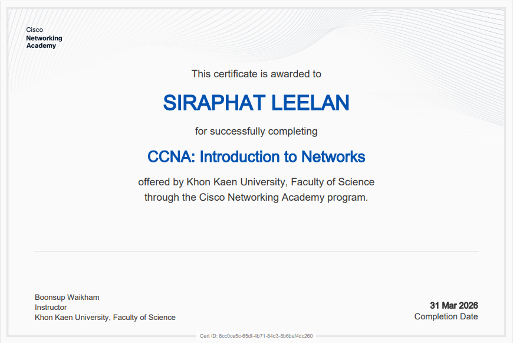
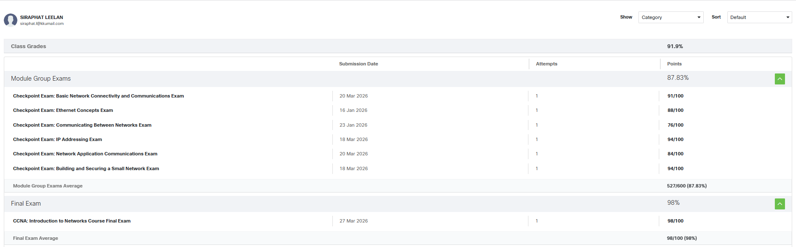

# 👨‍💻 Personal Portfolio

  
  
  

---

## 📌 About Me
- 👤 ชื่อ: **นายสิรภัทร ลีล้าน (Siraphat Leelan)**
- 🎓 Student ID: **673380067-2**
- 🏫 Section: **2**
- 📧 Email: **Siraphat.l@kkumail.com**

---

## 📚 Assignments

| # | 📝 ชื่องาน | 🔗 ลิงก์ |
|---|-----------|---------|
| 01 | Essay Link | [📄 View](./Assignments/Assignment1.pdf) |
| 02 | Topology | [📄 View](./Assignments/Assignment2.pdf) |
| 03 | Not Simple | [📄 View](./Assignments/Assignment3.pdf) |
| 04 | TCP / UDP | [📄 View](./Assignments/Assignment4.pdf) |
| 05 | New Network | [📄 View](./Assignments/NetworkLab5.pdf) |

---

## 🧪 Lab Reports

| # | 🧪 Lab | 🔗 ลิงก์ |
|---|--------|---------|
| LAB 1 | Lab Report 1 | [📄 View](./Labs/Lab_1.pdf) |
| LAB 2 | Lab Report 2 | [📄 View](./Labs/Lab_2.pdf) |
| LAB 3 | Lab Report 3 | [📄 View](./Labs/Lab_3.pdf) |
| LAB 4 | Lab Report 4 | [📄 View](./Labs/LAB_4.pdf) |
| LAB 5 | Lab Report 5 | [📄 View](./Labs/NetworkLab5.pdf) |

---

## 🚀 Final Project

| 📌 รายการ | 🔗 ลิงก์ |
|----------|---------|
| 📝 Github | [View](.https://github.com/genezobye/personal-portfolio/tree/main/Final%20Project) |
| 🌐 Story Website | [View](./ProjectArtifacts/tscom_story.html) |
| 📄 Report PDF | [View](./Group2TransSpacetime.pdf) |
| 🎥 Video Playlist | [Watch](https://www.youtube.com/playlist?list=PLKU5upiqtWwv8ekHqp4MfAlGZweASREWg) |

---

## 🏆 Certificate Gallery

  

---

## 📊 Checkpoint Exams Progress

  

---

## 💡 Notes
> Created by นายสิรภัทร ลีล้าน 673380067-2 sec2

---

## ⭐
